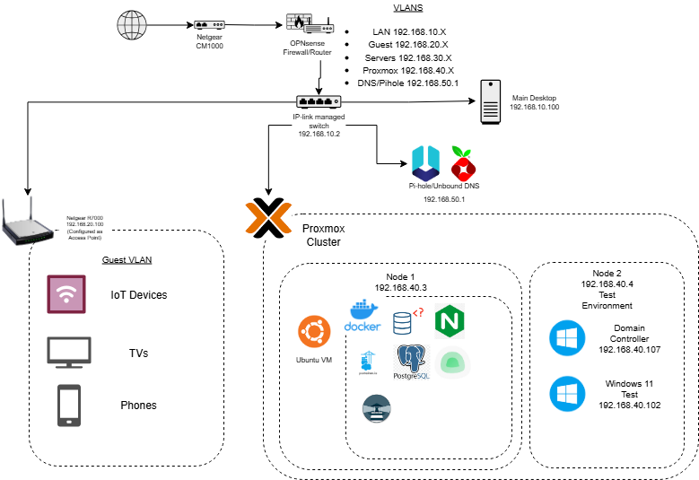

# 🧪 My HomeLab

Welcome to my homelab documentation repo! This project serves as a record of my self-hosted environment, configurations, and projects.

## 🌐 Overview

- **Purpose:** Learn networking, system administration, security, and virtualization.
- **Main Tools:** OPNsense, Proxmox, Docker, Ansible, Pi-hole, etc.

## 🖥️ Hardware Inventory

| Device            | Purpose           | OS / Firmware   |
|-------------------|-------------------|-----------------|
| ThinkCentre m910q x2 | Proxmox host      | Proxmox VE      |
| ThinkCentre M93P  | OPNsense firewall | OPNsense        |
| RPi 5             | Pi-hole / DNS     | Raspberry Pi OS |
| TP-Link TL-SG108PE  | VLAN switch       | Managed         |
| Netgear Nighthawk | Access Point | AC2600 |
| Netgear Nighthawk | Cable Modem | AC1900 |

More in [`hardware/inventory.md`](hardware/inventory.md)

## 🗺️ Network Diagram

## ⚙️ Configuration Snapshots

- Firewall rules (pfSense): [`configs/pfSense/`](configs/pfSense/)
- VM templates (Proxmox): [`configs/Proxmox/`](configs/Proxmox/)
- Web server config (nginx): [`configs/nginx/`](configs/nginx/)

## 🤖 Automation

See [`ansible/`](ansible/) directory for playbooks.

## 🛠️ Scripts

All scripts in [`scripts/`](scripts/)

## 🐞 Troubleshooting Log

Fixes and issues documented in [`logs/troubleshooting.md`](logs/troubleshooting.md)

## 🚧 Work in Progress

- VLANs and inter-VLAN routing
- Monitoring with Grafana
- VPN with WireGuard

## 📜 License

MIT License. Feel free to fork and adapt!
